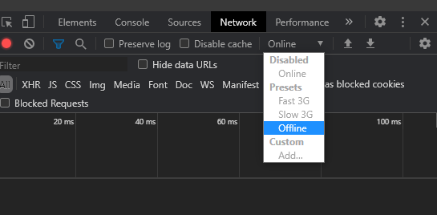

# Online/Offline Budget Tracker

## Table of Contents
- [Description](#description)
- [Usage](#usage)

## Description
This is an application for tracking transactions and shows your current balance based on the transactions. The application implements IndexedDB to allow the user to input transactions while offline and allows the application to update once it is back online.

## Usage
Upon opening the website you are able to input transactions to add and subtract to the balance. The graph will update in real time as transactions are added to show the users balance over time.

To test the offline functionality of the can be tested in chromium based browsers by pressing F12, navigating to the Network menu and changing the throttling to offline. You can then input some transactions, then switch back to online and see the application still update once it reconnects.

